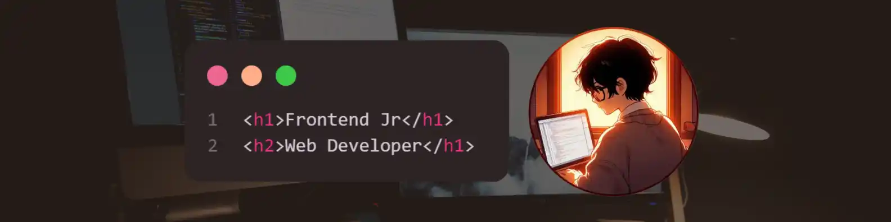

<h1 align="left">Hola!  Soy Cristhian Díaz</h1>

###

<h2 align="left">📚 About me</h2>

###

🖐️ Soy estudiante universitario y programador autodidacta en búsqueda de conocimiento y desafíos. 🚀 Soy joven y apasionado por la programación, y disfruto aprendiendo diversos lenguajes y tecnologías en tendencia 💻.

###

<h2 align="left"> Skills</h2>

###

  
  
  
  
  
  
  
  
  
  
  
  

  

###

<h2 align="left">💬 Contact me</h2>

✨ Si necesitas contactarme, estaré feliz de conversar contigo sobre 🤝 colaboración en proyectos emocionantes o 🌟 ideas innovadoras. ¡No dudes en escribirme! 📩

###

  
  
  
  
  
  
  <a href="https://paypal.me/csdp010?country.x=PE&locale.x=es_XC" target="_blank">

###

<h2 align="left"> Github Stats</h2>

###

  
  
  

###

<picture>
  <source media="(prefers-color-scheme: dark)" srcset="https://raw.githubusercontent.com/cristhian-sdp/cristhian-sdp/output/pacman-contribution-graph-dark.svg">
  <source media="(prefers-color-scheme: light)" srcset="https://raw.githubusercontent.com/cristhian-sdp/cristhian-sdp/output/pacman-contribution-graph.svg">
  
</picture>

###

