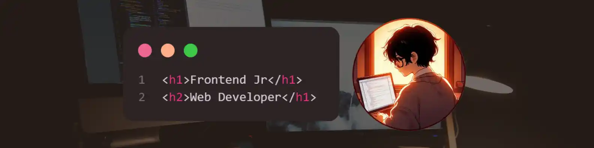

<h1 align="left">Hola!  Soy Cristhian Díaz</h1>

###

<h2 align="left">📚 About me</h2>

###

🖐️ Soy estudiante universitario y programador autodidacta en búsqueda de conocimiento y desafíos. 🚀 Soy joven y apasionado por la programación, y disfruto aprendiendo diversos lenguajes y tecnologías en tendencia 💻.

###

<h2 align="left"> Skills</h2>

###

<h3>🎨 Frontend </h3>

  <table>
    <tr>
      <td align="center">
         HTML
      </td>
      <td align="center">
         CSS
      </td>
      <td align="center">
         Tailwind
      </td>
      <td align="center">
         Bootstrap
      </td>
      <td align="center">
         JavaScript
      </td>
      <td align="center">
         Firebase
      </td>
      <td align="center">
         Cloudflare
      </td>
    </tr>
  </table>

###

<h3>🚀 Backend </h3>

  <table>
    <tr>
    <td align="center">
         Python
      </td>
      <td align="center">
         C#
      </td>
    </tr>
  </table>

###

<h3>🛠️ IDE & Tools </h3>

  <table>
    <tr>
      <td align="center">
         VS Code
      </td>
      <td align="center">
         Visual Studio
      </td>
      <td align="center">
         Notion
      </td>
      <td align="center">
         Git
      </td>
      <td align="center">
         GitHub
      </td>
    </tr>
  </table>

###

<h2 align="left"> Github Stats</h2>

###

<picture>
  <source media="(prefers-color-scheme: dark)" srcset="https://raw.githubusercontent.com/cristhian-sdp/cristhian-sdp/output/pacman-contribution-graph-dark.svg">
  <source media="(prefers-color-scheme: light)" srcset="https://raw.githubusercontent.com/cristhian-sdp/cristhian-sdp/output/pacman-contribution-graph.svg">
  
</picture>

###

<h2> Contact me</h2>

###

  
  
  
  

###
